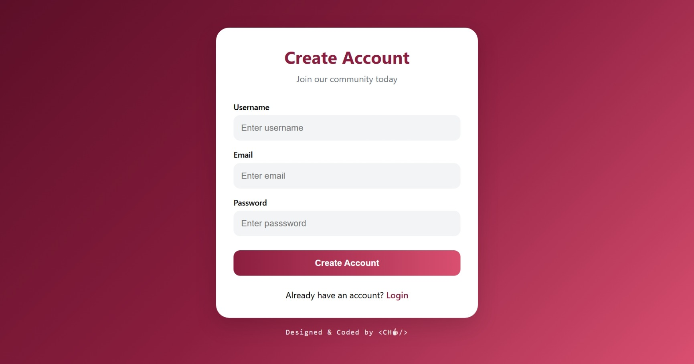
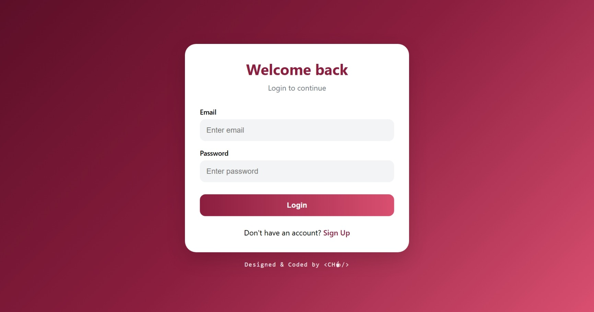
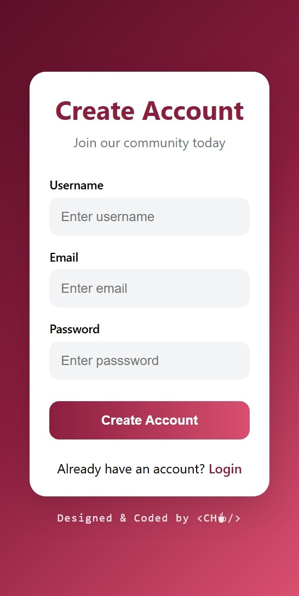
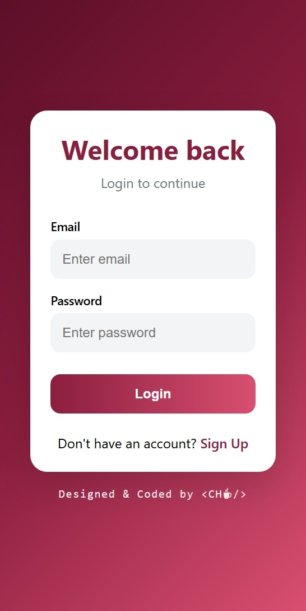

# Responsive Login & Signup Page

A modern and responsive authentication interface built with HTML, CSS, and JavaScript.

## Live Demo
[View Website](https://ultrachelleh.github.io/responsive-login-signup-page/)

## Preview

### Desktop — Sign Up



### Desktop — Login



### Mobile — Sign Up



### Mobile — Login



## Features

- Responsive design for desktop and mobile devices
- Login and Signup form switching with JavaScript
- Modern gradient user interface
- Interactive hover and focus states
- Semantic HTML structure
- Clean and organized project structure

## Built With

- HTML5
- CSS3
- Vanilla JavaScript

## Project Structure

```text
login-signup-page/
│
├── index.html
├── README.md
│
├── css/
│   └── style.css
│
├── js/
│   └── script.js
│
└── assets/
    └── images/
        ├── signup-desktop.jpeg
        ├── login-desktop.jpeg
        ├── signup-mobile.jpeg
        └── login-mobile.jpeg
```

## Learning Goals

This project was built to practice:

- Semantic HTML
- Responsive layouts
- CSS styling and layout techniques
- Basic DOM manipulation with JavaScript
- Project organization and GitHub workflow

## Author

Designed & Coded by <CH☕︎/>